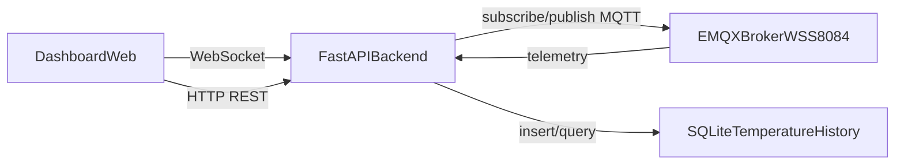

# Plan d’implémentation — application domotique web Python

## Framework recommandé
Je recommande **FastAPI** avec un front léger en **HTML/CSS/JS** (ou HTMX ensuite), pour ces raisons :
- excellent support asynchrone (important pour MQTT + WebSocket en temps réel),
- rapide à mettre en place pour un MVP local,
- architecture évolutive si tu veux ensuite une SPA React/Vue.

## Architecture cible (MVP)
- Backend Python FastAPI
- Client MQTT (abonné + publication commandes)
- Base SQLite (historique températures)
- WebSocket backend -> navigateur (mise à jour temps réel du dashboard)
- UI web : pièces, lampes, volets, capteurs + modale histogramme

## Convention MQTT à définir (avant codage détaillé)
Comme tu n’as pas encore de contrat MQTT, on partira sur une convention propre sous `CONNECTLEARNING/DURAND/` :
- `home/<room>/temperature` (télémétrie)
- `home/<room>/light/set` (commande ON/OFF)
- `home/<room>/light/state` (état)
- `home/<room>/shutter/set` (OPEN/CLOSE/STOP)
- `home/<room>/shutter/state` (état)
- `home/<room>/fire/state` (NORMAL/ALERT)
- `home/<room>/fire/test` (commande de test capteur)

Pièces couvertes : `salle_de_bain`, `wc`, `chambre1`, `chambre2`, `salon`, `cuisine`.

## Structure de code proposée
- [backend/app/main.py](backend/app/main.py) : API FastAPI + routes + websocket
- [backend/app/mqtt_client.py](backend/app/mqtt_client.py) : connexion broker MQTT WSS, subscriptions, publish
- [backend/app/models.py](backend/app/models.py) : schémas Pydantic
- [backend/app/storage.py](backend/app/storage.py) : SQLite (insert température + requêtes histogramme)
- [backend/app/topics.py](backend/app/topics.py) : mapping topics/rooms/devices
- [frontend/index.html](frontend/index.html) : dashboard principal
- [frontend/app.js](frontend/app.js) : interactions UI (clic ampoule, volet, capteur/modale)
- [frontend/styles.css](frontend/styles.css) : styles du tableau de bord

## Comportements fonctionnels
- Clic ampoule : envoi MQTT `.../light/set` puis mise à jour état visuel dès confirmation `.../light/state`.
- Clic volet : envoi MQTT `.../shutter/set` (OPEN/CLOSE) puis synchro avec `.../shutter/state`.
- Température en direct : réception MQTT `.../temperature` + persistance SQLite.
- Clic capteur température : ouverture modale, appel API historique, affichage histogramme (Chart.js).
- Détecteur incendie : affichage état `NORMAL`/`ALERT` en temps réel via `.../fire/state` avec badge visuel fort (et son d’alerte côté UI en cas d’`ALERT`).
- Test détecteur incendie : bouton de test par pièce publiant sur `.../fire/test`.

## API backend (MVP)
- `GET /api/rooms/state` : état courant de toutes les pièces
- `POST /api/rooms/{room}/light/toggle`
- `POST /api/rooms/{room}/shutter/toggle`
- `POST /api/rooms/{room}/fire/test`
- `GET /api/rooms/{room}/temperature/history?from=...&to=...&bucket=hour`
- `WS /ws/state` : push temps réel des états/mesures

## Sécurité et robustesse (phase locale)
- Variables d’environnement pour config broker/topic root
- Reconnexion MQTT automatique (backoff)
- Validation stricte payloads MQTT
- Journalisation des messages entrants/sortants

## Validation
- Tests manuels locaux :
  - toggle lumière sur chaque pièce,
  - ouverture/fermeture volets,
  - réception et stockage températures,
  - ouverture modale et histogramme correct,
  - simulation alerte incendie et retour à l’état normal,
  - vérification du bouton de test détecteur.
- Tests unitaires backend : mapping topics et parsing payload.

## Étapes d’exécution
1. Bootstrap projet FastAPI + front statique.
2. Implémenter contrat MQTT + client WSS EMQX.
3. Ajouter persistance SQLite température.
4. Construire dashboard + actions clic (ampoules/volets).
5. Ajouter modale histogramme température.
6. Ajouter les détecteurs incendie (abonnement MQTT + alertes UI + endpoint test).
7. Valider en local et documenter lancement.